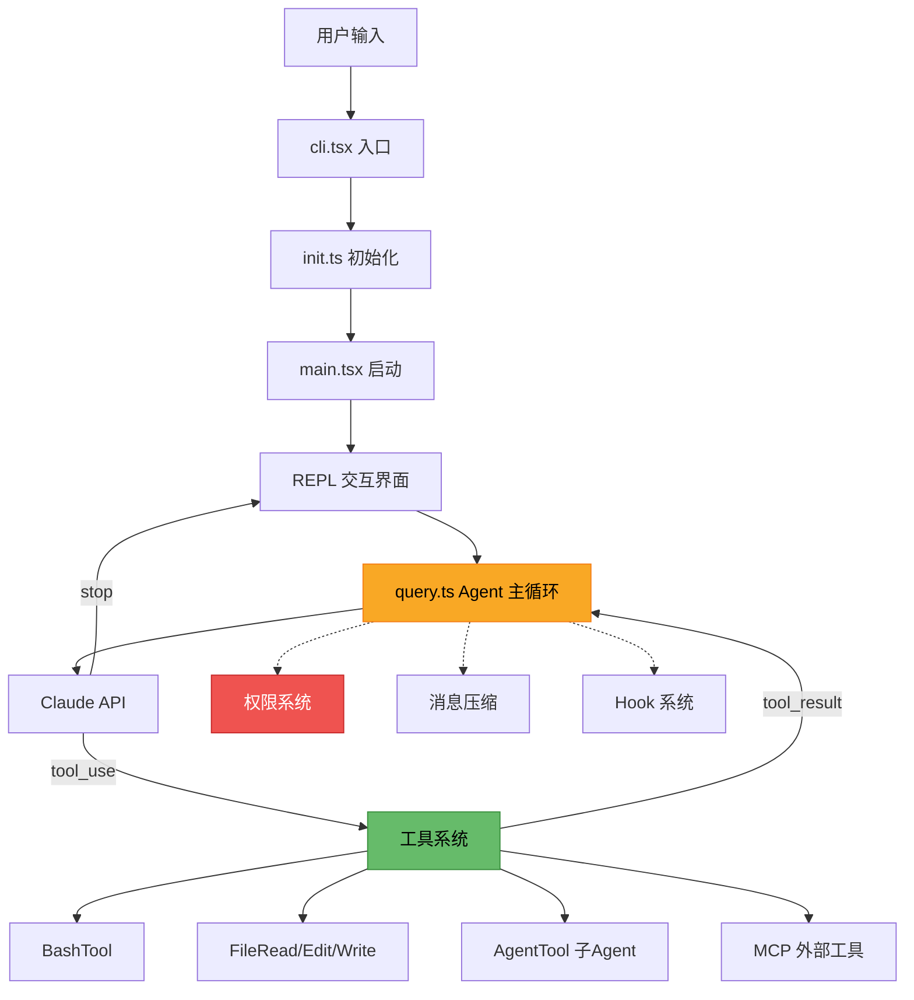

# 第 1 章：走进 Claude Code

> Claude Code 不是一个聊天机器人，而是一个运行在终端里、能读写文件、执行命令、管理 Git 的 AI Agent。

## 1.1 Claude Code 是什么

打开终端，输入 `claude`，你会看到一个交互式的命令行界面。你可以用自然语言告诉它"帮我重构这个函数"、"找到所有用到 auth 的地方"、"写一个单元测试"——然后它真的会去做。它会读取你的代码，调用合适的工具，编辑文件，运行测试，甚至帮你提交 Git。

这就是 Claude Code：一个以大语言模型为"大脑"、以终端为"身体"的编程 Agent。

与传统的 IDE 插件或代码补全工具不同，Claude Code 是一个**完整的 Agent 系统**。它有自己的工具箱（40+ 内置工具）、权限系统（防止误操作）、上下文管理（应对超长对话）和扩展机制（Hook、MCP、Plugin）。理解它的架构，就是理解工业级 AI Agent 是如何设计和实现的。

## 1.2 技术栈概览

Claude Code 的技术选型可以用一句话概括：**TypeScript + React/Ink + Node.js**。

```text
┌─────────────────────────────────────────────┐
│                Claude Code                   │
├─────────────┬───────────────┬───────────────┤
│  终端 UI    │  Agent 核心   │   工具系统    │
│  React/Ink  │  query.ts     │   40+ Tools   │
├─────────────┼───────────────┼───────────────┤
│  Anthropic SDK (模型调用)                    │
│  MCP SDK (外部工具协议)                      │
│  Zod (运行时数据校验)                        │
├─────────────────────────────────────────────┤
│  Node.js >= 18 · ESM · esbuild 单文件打包   │
└─────────────────────────────────────────────┘
```

几个关键选型值得注意：

**React/Ink 做终端 UI**：是的，你没看错——Claude Code 用 React 来渲染终端界面。Ink 是一个将 React 组件模型映射到终端输出的框架。这意味着 Claude Code 的 UI 层和你写的 Web 应用使用相同的心智模型：组件、状态、Hook、JSX。对前端工程师来说，这是一个非常熟悉的领域。

**Zod 做运行时校验**：LLM 返回的 JSON 不可信——它可能格式错误、缺少字段、类型不对。Claude Code 用 Zod 为每个工具定义输入 Schema，在执行前严格校验。这是 Agent 系统中非常重要的防御层。

**单文件打包分发**：整个项目通过 esbuild 打包为一个 `dist/cli.js` 文件。所有运行时依赖（Anthropic SDK、MCP SDK、Ink、Zod 等）都被内联打包，`package.json` 中不声明任何 `dependencies`——只有两个 `devDependencies`：esbuild 和 TypeScript。

```json [package.json]
{
  "name": "@anthropic-ai/claude-code-source",
  "version": "2.1.88",
  "type": "module",
  "devDependencies": {
    "esbuild": "0.27.4",
    "typescript": "6.0.2"
  }
}
```

这种极简的分发策略意味着用户只需要 `npm install -g @anthropic-ai/claude-code` 就能获得一个自包含的 CLI 工具，不需要解决任何依赖冲突。

## 1.3 目录结构总览

Claude Code 的 `src/` 目录包含 30+ 个模块。乍一看可能让人头大，但它们的职责划分是清晰的。我们按功能域来分组理解：

### 入口与启动

| 目录/文件 | 职责 |
|-----------|------|
| `entrypoints/cli.tsx` | CLI 入口，参数解析，快速路径分发 |
| `entrypoints/init.ts` | 初始化流程：配置加载、认证、远程设置 |
| `main.tsx` | 完整启动：工具注册、权限上下文、REPL 渲染 |
| `entrypoints/mcp.ts` | MCP Server 模式入口（作为工具提供者运行） |
| `entrypoints/sdk/` | SDK 模式，供程序化调用 |

整个启动是一个三阶段链：`cli.tsx` → `init.ts` → `main.tsx`，每一阶段按需加载，优化启动性能。这部分我们在第 2 章详细展开。

### Agent 核心

| 目录/文件 | 职责 |
|-----------|------|
| `query.ts` | **Agent 主循环**——全书最核心的文件 |
| `QueryEngine.ts` | 对 `query()` 的封装，面向 SDK/无头模式 |
| `Tool.ts` | Tool 接口定义（name、schema、execute） |
| `tools.ts` | 工具注册表，基于 feature flag 过滤 |
| `tools/` | 40+ 内置工具的具体实现 |

`query.ts` 中的主循环是整个 Agent 的心脏：调用 Claude API → 解析响应 → 遇到 tool_use → 执行工具 → 将结果追加到消息 → 继续循环。直到模型返回 `stop` 或触及限制。我们在第 4 章会逐行走读这个循环。

### 工具系统

`src/tools/` 下有 35 个工具目录，按用途可以分为几类：

| 类别 | 工具 |
|------|------|
| 文件操作 | `FileReadTool`、`FileWriteTool`、`FileEditTool`、`GlobTool`、`GrepTool` |
| 终端执行 | `BashTool`、`PowerShellTool` |
| Web 能力 | `WebFetchTool`、`WebSearchTool` |
| Agent 协作 | `AgentTool`（子 Agent）、`SendMessageTool` |
| 任务管理 | `TaskCreateTool`、`TaskGetTool`、`TaskUpdateTool` 等 |
| 模式控制 | `EnterPlanModeTool`、`EnterWorktreeTool` |
| MCP 集成 | `MCPTool`、`ListMcpResourcesTool`、`ReadMcpResourceTool` |

每个工具都实现统一的 `Tool` 接口，用 Zod 定义输入 Schema，通过 async generator 执行并流式返回结果。这套设计我们在第 6-8 章详细分析。

### 权限与安全

| 目录/文件 | 职责 |
|-----------|------|
| `hooks/useCanUseTool.tsx` | 权限判定的核心 Hook |
| `utils/permissions/` | 多层权限规则引擎 |
| `tools/EnterPlanModeTool/` | Plan Mode：先展示操作计划，用户审阅后执行 |

AI Agent 能执行真实操作（删文件、跑命令、推代码），权限系统是它能安全落地的关键。Claude Code 设计了四层权限架构：配置规则 → 自动分类器 → 交互审批 → 兜底拒绝。第 9-10 章会展开分析。

### 扩展机制

| 目录 | 职责 |
|------|------|
| `utils/hooks/` | Hook 系统：在 Agent 生命周期关键节点插入自定义逻辑 |
| `services/mcp/` | MCP 集成：接入外部工具服务的标准协议 |
| `skills/` | Skill 系统：预注册的 slash command |
| `plugins/` | Plugin 架构：插件清单、生命周期钩子 |

这三套扩展机制（Hook、MCP、Skill/Plugin）让 Claude Code 从一个封闭工具变成了一个开放平台。第 11-13 章逐一拆解。

### UI 与状态

| 目录 | 职责 |
|------|------|
| `components/` | Ink/React 终端 UI 组件 |
| `screens/` | 顶层页面（REPL、Doctor 等） |
| `state/` | Zustand 风格的全局状态管理 |
| `context/` | React Context（模态框、通知等） |
| `services/compact/` | 消息压缩：解决 Context Window 有限的核心矛盾 |

### 其他模块

| 目录 | 职责 |
|------|------|
| `coordinator/` | 多 Agent 协调（Leader + Worker 架构） |
| `services/api/` | Claude API 调用封装 |
| `services/oauth/` | OAuth2 认证 |
| `migrations/` | 数据迁移 |
| `voice/` | 语音交互 |

## 1.4 一图看全貌


下面这张图展示了 Claude Code 的核心架构关系。不用现在就理解每个部分——它是你阅读后续章节时的导航图：



核心数据流是一个循环：**用户输入 → Agent 主循环 → 调用 Claude API → 模型决定使用工具 → 执行工具 → 结果回传给模型 → 继续循环**。围绕这个核心循环，权限系统守护安全边界，消息压缩管理上下文窗口，Hook 系统提供扩展点。

## 1.5 编译配置

Claude Code 的 TypeScript 配置反映了它的工程取向：

```ts [tsconfig.json]
{
  "compilerOptions": {
    "target": "ES2022",          // 输出现代 JS，保留 async/await
    "module": "ESNext",          // 原生 ES Module
    "moduleResolution": "bundler", // 为 esbuild 打包优化
    "jsx": "react-jsx",          // 支持 .tsx，React 17+ 自动转换
    "strict": false,             // 宽容模式（反编译代码的务实选择）
    "lib": ["ES2022", "DOM"]     // 包含 DOM 类型（Ink 需要部分 DOM API）
  }
}
```

几个值得注意的点：

- **`moduleResolution: "bundler"`**：这是一个较新的选项，告诉 TypeScript 用打包器（esbuild）的模块解析策略，而非 Node.js 原生策略。这意味着可以省略文件扩展名、使用 `exports` 字段等。
- **`strict: false`**：作为一个反编译还原的项目，关闭严格模式是务实的选择。
- **`lib` 包含 `DOM`**：虽然是 CLI 工具，但 Ink 框架底层需要部分 DOM 类型定义（如 `setTimeout` 的返回类型）。

## 1.6 如何阅读本书

本书基于 Claude Code **v2.1.88**（commit `2ca5dda`）的源码，不追踪上游更新。

全书采用**自底向上**的组织方式，沿着代码执行路径逐层递进：

1. **第一部分（全局视角）**：你在这里。了解项目全貌和启动流程。
2. **第二部分（Agent 核心循环）**：从 System Prompt 的构建到 Agent Loop 的完整生命周期——这是全书最核心的部分。
3. **第三部分（工具系统）**：Agent 的"手"——40+ 工具的接口设计、并发编排和关键实现。
4. **第四部分（权限与安全）**：Agent 的"边界"——多层权限系统如何保障安全。
5. **第五部分（扩展机制）**：Agent 的"开放性"——Hook、MCP、Skill/Plugin 三套扩展体系。
6. **第六部分（高级特性）**：上下文压缩、状态管理、多 Agent 协作等进阶话题。

**推荐的阅读方式**：

- **顺序阅读**：按章节顺序走，每章的概念铺垫都为后续章节服务。
- **按需跳读**：如果你对某个话题特别感兴趣（比如权限系统），可以直接跳到对应章节。每章开头会标注前序依赖。
- **对照源码**：建议在阅读时打开 `claude-code-source-code` 仓库，对照着看完整的源码文件。书中只展示关键片段，完整上下文在源码里。

每章的结构是统一的：**概念引入 → 架构图/流程图 → 源码走读 → 小结**。先建立概念，再看代码，最后回顾设计决策。

## 小结

本章我们了解了 Claude Code 的全貌：

- **它是什么**：一个以 LLM 为"大脑"、终端为"身体"的编程 Agent，具备完整的工具系统、权限系统和扩展机制。
- **技术栈**：TypeScript + React/Ink + Node.js，esbuild 单文件打包分发。
- **核心架构**：启动链（cli → init → main）→ Agent 主循环（query.ts）→ 工具系统（40+ Tools）→ 权限守护 + 上下文压缩 + 扩展机制。
- **目录结构**：30+ 模块，按功能域清晰划分——入口、Agent 核心、工具、权限、扩展、UI/状态。

下一章，我们进入启动流程，看看从你在终端输入 `claude` 到 REPL 准备就绪，中间究竟发生了什么。
