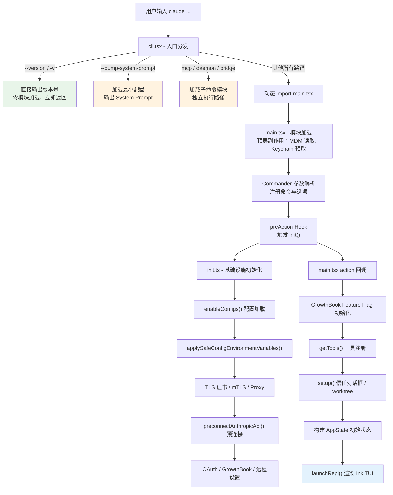

# 第 2 章 启动流程——从命令行到 REPL

## 2.1 概念引入：为什么启动要分三阶段？

当你在终端输入 `claude` 并按下回车，到看到交互式 REPL 界面，中间发生了什么？对于一个功能丰富的 CLI 应用来说，启动过程涉及参数解析、配置加载、认证校验、网络初始化、feature flag 拉取、工具注册、UI 渲染等大量工作。如果把这些逻辑全部放在一个文件里按顺序执行，结果就是——即使用户只想查看一个 `--version`，也要等待全部模块加载完成。

Claude Code 的启动流程被精心拆分为三个阶段：

| 阶段 | 文件 | 职责 | 设计目标 |
|------|------|------|----------|
| 第一阶段 | `cli.tsx` | 快速路径分发 | 零模块加载处理简单命令 |
| 第二阶段 | `init.ts` | 基础设施初始化 | 配置、认证、网络，一次性完成 |
| 第三阶段 | `main.tsx` | 完整启动 | Commander 参数解析、工具注册、REPL 渲染 |

这种分阶段设计的核心思路是**渐进式加载**（Progressive Loading）：只在需要时才加载对应模块，让简单场景的启动速度尽可能快。`--version` 可以在毫秒级返回，而完整的 REPL 启动则经历完整的三阶段流水线。

## 2.2 架构图：三阶段启动链


以下 Mermaid 图展示了从用户输入到 REPL 就绪的完整流程：



## 2.3 源码走读

### 2.3.1 cli.tsx：快速路径与入口分发

`cli.tsx` 是整个应用的真正入口。它的设计哲学可以用一句话概括：**所有 `import` 都是动态的，只有被激活的路径才会加载模块**。

#### 快速路径：--version 的零模块加载

```ts [src/entrypoints/cli.tsx]
async function main(): Promise<void> {
  const args = process.argv.slice(2);

  // Fast-path for --version/-v: zero module loading needed
  if (args.length === 1 && (args[0] === '--version' || args[0] === '-v' || args[0] === '-V')) { // [!code highlight]
    // MACRO.VERSION is inlined at build time
    console.log(`${MACRO.VERSION} (Claude Code)`);
    return; // [!code highlight]
  }
  // ...
}
```

这是最极致的快速路径优化。注意几个关键设计决策：

1. **不使用任何 `import`**：版本号通过 `MACRO.VERSION` 在构建时内联，无需加载任何模块。
2. **手动解析 `process.argv`**：绕开了 Commander 参数解析框架。对于 `--version` 这种简单场景，引入任何参数解析库都是不必要的开销。
3. **直接 `return`**：不调用 `process.exit()`，让事件循环自然结束。

#### 子命令快速路径

除了 `--version`，`cli.tsx` 还为多种子命令提供了独立的快速路径：

```ts [src/entrypoints/cli.tsx]
  // Fast-path for `--daemon-worker=<kind>` (internal — supervisor spawns this).
  // Must come before the daemon subcommand check: spawned per-worker, so
  // perf-sensitive. No enableConfigs(), no analytics sinks at this layer —
  // workers are lean.
  if (feature('DAEMON') && args[0] === '--daemon-worker') { // [!code highlight]
    const { runDaemonWorker } = await import('../daemon/workerRegistry.js');
    await runDaemonWorker(args[1]);
    return;
  }
```

这里的 `feature()` 函数来自 `bun:bundle`，是构建时的 Dead Code Elimination（DCE）门控。如果某个 feature flag 在构建时被关闭，整个 `if` 块会被编译器删除，不会出现在最终产物中。

每个子命令路径（`bridge`、`daemon`、`bg sessions`、`templates`、`environment-runner` 等）都遵循相同的模式：

1. 用 `feature()` 做构建时门控
2. 用 `args[0]` 做简单的字符串匹配
3. 动态 `import` 对应模块
4. 执行后 `return`

#### 分发到完整 CLI

当所有快速路径都不匹配时，`cli.tsx` 才会加载完整的 `main.tsx`：

```ts [src/entrypoints/cli.tsx]
  // --bare: set SIMPLE early so gates fire during module eval / commander
  // option building (not just inside the action handler).
  if (args.includes('--bare')) {
    process.env.CLAUDE_CODE_SIMPLE = '1';
  }

  // No special flags detected, load and run the full CLI
  const { startCapturingEarlyInput } = await import('../utils/earlyInput.js'); // [!code highlight]
  startCapturingEarlyInput();
  profileCheckpoint('cli_before_main_import');
  const { main: cliMain } = await import('../main.js'); // [!code highlight]
  profileCheckpoint('cli_after_main_import');
  await cliMain();
```

注意 `startCapturingEarlyInput()` 的调用时机——在 `main.tsx` 加载之前。由于 `main.tsx` 的模块加载需要约 135ms（大量 import 语句的求值），这段时间用户可能已经开始打字。`earlyInput` 模块会在这段空档缓存用户的键盘输入，等 REPL 就绪后回放，避免丢失击键。

### 2.3.2 init.ts：基础设施初始化

`init.ts` 通过 `memoize` 包装，确保无论被调用多少次，初始化逻辑只执行一次。

```ts [src/entrypoints/init.ts]
export const init = memoize(async (): Promise<void> => { // [!code highlight]
  const initStartTime = Date.now();
  logForDiagnosticsNoPII('info', 'init_started');
  profileCheckpoint('init_function_start');
  // ...
});
```

#### 配置加载顺序

初始化的第一步是启用配置系统，并**分两步**应用环境变量：

```ts [src/entrypoints/init.ts]
    enableConfigs(); // [!code highlight]

    // Apply only safe environment variables before trust dialog // [!code highlight]
    // Full environment variables are applied after trust is established
    applySafeConfigEnvironmentVariables(); // [!code highlight]

    // Apply NODE_EXTRA_CA_CERTS from settings.json to process.env early,
    // before any TLS connections. Bun caches the TLS cert store at boot
    // via BoringSSL, so this must happen before the first TLS handshake.
    applyExtraCACertsFromConfig(); // [!code highlight]
```

为什么要分两步？因为配置文件中可能包含 `LD_PRELOAD`、`PATH` 等危险的环境变量。在用户通过信任对话框（Trust Dialog）确认之前，只应用安全的环境变量子集。完整的环境变量（`applyConfigEnvironmentVariables()`）要等到信任建立之后才应用——这个调用发生在 `main.tsx` 的后续流程中。

#### 并行启动优化

`init.ts` 大量使用了 fire-and-forget 的异步任务来并行执行耗时操作：

```ts [src/entrypoints/init.ts]
    // Initialize 1P event logging (deferred to avoid loading OpenTelemetry sdk-logs at startup)
    void Promise.all([ // [!code highlight]
      import('../services/analytics/firstPartyEventLogger.js'),
      import('../services/analytics/growthbook.js'),
    ]).then(([fp, gb]) => {
      fp.initialize1PEventLogging();
      gb.onGrowthBookRefresh(() => {
        void fp.reinitialize1PEventLoggingIfConfigChanged();
      });
    });

    // Populate OAuth account info if it is not already cached
    void populateOAuthAccountInfoIfNeeded(); // [!code highlight]

    // Initialize JetBrains IDE detection asynchronously
    void initJetBrainsDetection(); // [!code highlight]

    // Detect GitHub repository asynchronously
    void detectCurrentRepository(); // [!code highlight]
```

这些以 `void` 前缀调用的异步函数不会阻塞 `init()` 的返回。它们利用等待网络 I/O 的空隙并行执行，结果在后续需要时通过缓存获取。

#### 网络层初始化

TLS 和代理的配置顺序有严格要求：

```ts [src/entrypoints/init.ts]
    // Configure global mTLS settings
    configureGlobalMTLS(); // [!code highlight]

    // Configure global HTTP agents (proxy and/or mTLS)
    configureGlobalAgents(); // [!code highlight]

    // Preconnect to the Anthropic API — overlap TCP+TLS handshake
    // (~100-200ms) with the ~100ms of action-handler work before the API request.
    preconnectAnthropicApi(); // [!code highlight]
```

先配置 mTLS 证书，再配置代理，最后发起 API 预连接。`preconnectAnthropicApi()` 是一个精妙的优化：在用户还没输入第一条消息之前，提前完成 TCP + TLS 握手（约 100-200ms），这样当第一次 API 请求发生时，连接已经就绪。

#### Telemetry 的延迟初始化

遥测（Telemetry）模块的加载被刻意延后：

```ts [src/entrypoints/init.ts]
async function setMeterState(): Promise<void> {
  // Lazy-load instrumentation to defer ~400KB of OpenTelemetry + protobuf // [!code highlight]
  const { initializeTelemetry } = await import(
    '../utils/telemetry/instrumentation.js'
  );
  const meter = await initializeTelemetry();
  // ...
}
```

注释中明确写道：OpenTelemetry + protobuf 模块约 400KB，gRPC 导出器更是达到约 700KB。这些模块只在遥测实际初始化时才加载，避免拖慢启动速度。

### 2.3.3 main.tsx：完整启动

`main.tsx` 是整个应用中最庞大的文件，承担了从参数解析到 REPL 渲染的所有"重活"。

#### 顶层副作用：抢跑子进程

```ts [src/main.tsx]
import { profileCheckpoint, profileReport } from './utils/startupProfiler.js';

profileCheckpoint('main_tsx_entry');
import { startMdmRawRead } from './utils/settings/mdm/rawRead.js'; // [!code highlight]

startMdmRawRead(); // [!code highlight]
import { ensureKeychainPrefetchCompleted, startKeychainPrefetch } from './utils/secureStorage/keychainPrefetch.js';

startKeychainPrefetch(); // [!code highlight]
```

这段代码刻意把 `startMdmRawRead()` 和 `startKeychainPrefetch()` 放在了模块的最顶部，夹在 `import` 语句之间执行。原因在注释中解释得很清楚：

- **MDM 读取**会启动 `plutil`（macOS）或 `reg query`（Windows）子进程来读取企业管理策略，这些子进程可以和后续约 135ms 的 import 求值并行执行。
- **Keychain 预取**并行发起 macOS 钥匙串的 OAuth 和 legacy API Key 两次读取，避免后续在 `init()` 中同步串行读取（约 65ms）。

这是一种非常激进的启动优化：利用 JavaScript 模块求值的时间窗口来并行执行 I/O 操作。

#### Commander 参数解析与 preAction Hook

`main.tsx` 使用 Commander 框架来定义命令行参数，但通过 `preAction` Hook 将 `init()` 的调用延迟到命令实际执行时：

```ts [src/main.tsx]
  const program = new CommanderCommand()
    .configureHelp(createSortedHelpConfig())
    .enablePositionalOptions();

  program.hook('preAction', async thisCommand => { // [!code highlight]
    // Await async subprocess loads started at module evaluation (lines 12-20).
    await Promise.all([
      ensureMdmSettingsLoaded(),
      ensureKeychainPrefetchCompleted()
    ]); // [!code highlight]
    await init(); // [!code highlight]

    // Attach logging sinks
    const { initSinks } = await import('./utils/sinks.js');
    initSinks();

    // Load remote managed settings (non-blocking, fail-open)
    void loadRemoteManagedSettings();
    void loadPolicyLimits();

    runMigrations();
  });
```

`preAction` Hook 的设计意图在注释中说得很清楚：**只在执行命令时才运行初始化，显示帮助信息（`--help`）时跳过**。这样 `claude --help` 也能快速返回，不需要等待配置加载和网络初始化。

注意 `ensureMdmSettingsLoaded()` 和 `ensureKeychainPrefetchCompleted()` 在这里被 `await`——它们等待的是模块顶层启动的子进程。由于这些子进程在 import 求值期间就已经开始运行，到达这里时通常已经完成，`await` 几乎是零成本的。

#### 工具注册与权限上下文

工具加载发生在 action 回调内部：

```ts [src/main.tsx]
    let tools = getTools(toolPermissionContext); // [!code highlight]

    // Apply coordinator mode tool filtering for headless path
    if (feature('COORDINATOR_MODE') && isEnvTruthy(process.env.CLAUDE_CODE_COORDINATOR_MODE)) {
      const { applyCoordinatorToolFilter } = await import('./utils/toolPool.js');
      tools = applyCoordinatorToolFilter(tools);
    }
```

`getTools()` 接收一个 `toolPermissionContext` 参数，它决定了哪些工具可用、哪些需要用户确认。权限上下文在此之前通过 `initializeToolPermissionContext()` 构建，综合了 `--dangerously-skip-permissions`、`--permission-mode`、`--allowed-tools` 等 CLI 参数。

#### AppState 构建与 REPL 渲染

最终，所有准备工作完成后，`main.tsx` 构建初始状态对象并启动 REPL：

```ts [src/main.tsx]
    const initialState: AppState = { // [!code highlight]
      settings: getInitialSettings(),
      tasks: {},
      verbose: verbose ?? getGlobalConfig().verbose ?? false,
      mainLoopModel: initialMainLoopModel,
      toolPermissionContext: effectiveToolPermissionContext,
      agentDefinitions,
      mcp: {
        clients: [],
        tools: [],
        commands: [],
        resources: {},
        pluginReconnectKey: 0
      },
      // ... 30+ 个字段
    };
```

`AppState` 是一个包含 30 多个字段的状态对象，涵盖了模型配置、工具权限、MCP 客户端、插件、远程连接、文件历史等所有运行时状态。它通过 `createStore()` 创建为一个可订阅的状态仓库，配合 `onChangeAppState` 回调驱动 UI 更新。

最终的 REPL 渲染通过 `launchRepl()` 触发：

```ts [src/main.tsx]
      await launchRepl(root, { // [!code highlight]
        getFpsMetrics,
        stats,
        initialState
      }, {
        ...sessionConfig,
        initialMessages,
        pendingHookMessages
      }, renderAndRun); // [!code highlight]
```

`launchRepl` 将 Ink（React 的终端渲染框架）挂载到终端，用户看到交互界面，整个启动流程至此完成。

#### 延迟预取：首次渲染后的后台工作

REPL 渲染后，`main.tsx` 还会启动一批后台预取任务：

```ts [src/main.tsx]
export function startDeferredPrefetches(): void {
  // Process-spawning prefetches (consumed at first API call, user is still typing)
  void initUser(); // [!code highlight]
  void getUserContext();
  prefetchSystemContextIfSafe();
  void getRelevantTips();

  // Analytics and feature flag initialization
  void initializeAnalyticsGates(); // [!code highlight]
  void prefetchOfficialMcpUrls();
  void refreshModelCapabilities();

  // File change detectors deferred from init() to unblock first render
  void settingsChangeDetector.initialize();
}
```

这些预取利用了"用户还在打字"的时间窗口。`initUser()`、`getUserContext()` 等函数的结果会被缓存，在用户发送第一条消息时通过 memoize 直接命中缓存，避免了首次交互的延迟。

## 2.4 小结：三阶段设计的深层思考

### 职责边界

三阶段的职责边界非常清晰：

- **cli.tsx**：决定"做什么"。它是一个轻量级路由器，根据命令行参数决定走快速路径还是完整路径。它自身不包含任何业务逻辑，所有 import 都是动态的。
- **init.ts**：建立"运行环境"。配置系统、认证凭据、网络层——这些是任何后续操作都需要的基础设施。通过 `memoize` 保证幂等性，可以被多个路径安全调用。
- **main.tsx**：执行"核心逻辑"。Commander 参数解析、工具注册、状态构建、UI 渲染——这些都是特定于 REPL 交互场景的重量级操作。

### 启动性能的五层优化

回顾整个启动流程，可以提炼出五层性能优化策略：

1. **构建时消除**：`feature()` 门控在打包时删除不需要的代码路径。
2. **零加载快速路径**：`--version` 不加载任何模块，构建时内联版本号。
3. **动态 import**：所有非关键路径的模块都通过 `await import()` 延迟加载。
4. **并行子进程**：MDM 读取和 Keychain 预取在模块求值阶段就开始运行。
5. **后台预取**：网络预连接、用户上下文、系统上下文等在 REPL 渲染后异步执行。

这种多层次的优化让 Claude Code 在不同场景下都能获得最佳的启动体验：简单命令毫秒级返回，完整 REPL 启动也不会让用户感到明显的等待。

---

> **下一章预告**：第 3 章将深入 System Prompt 的动态构建过程。Claude Code 的系统提示并不是一个静态字符串，而是根据当前项目上下文（CLAUDE.md 文件、Git 状态、可用工具列表等）动态拼装的。我们将分析 `getSystemPrompt()` 的实现，了解提示词是如何分层组织、按需注入的。
